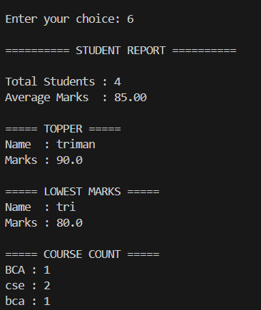

# 🎓 Smart Student Management System

## 📌 Project Overview

The Smart Student Management System is a Python-based console application that helps manage student records efficiently. It is developed using Object-Oriented Programming (OOP) concepts and stores data in a JSON file.

---

## ✨ Features

- Add Student
- View Students
- Search Student
- Update Student
- Delete Student
- Generate Student Report
- Duplicate Roll Number Validation
- Input Validation

---

## 🛠 Technologies Used

- Python 3
- Object-Oriented Programming (OOP)
- JSON
- Tabulate Library

---

## 📂 Project Structure

```
SmartStudentManagementSystem
│── main.py
│── database.py
│── student.py
│── utils.py
│── report.py
│── login.py
│── students.json
│── requirements.txt
│── README.md
```

---

## ▶️ How to Run

### Step 1

Clone the repository

```bash
git clone https://github.com/Trimanpreet/SmartStudentManagementSystem.git
```

### Step 2

Go inside the project folder

```bash
cd SmartStudentManagementSystem
```

### Step 3

Install the required library

```bash
pip install -r requirements.txt
```

### Step 4

Run the project

```bash
python main.py
```

---

## 📊 Report Features

- Total Students
- Average Marks
- Highest Scorer
- Lowest Scorer

---

## 🚀 Future Improvements

- SQLite Database
- GUI using Tkinter
- Flask Web Application
- User Authentication

---

## 👨‍💻 Author

## 📸 Screenshots

### Main Menu


### View Students


### Generate Report



**Trimanpreet**
